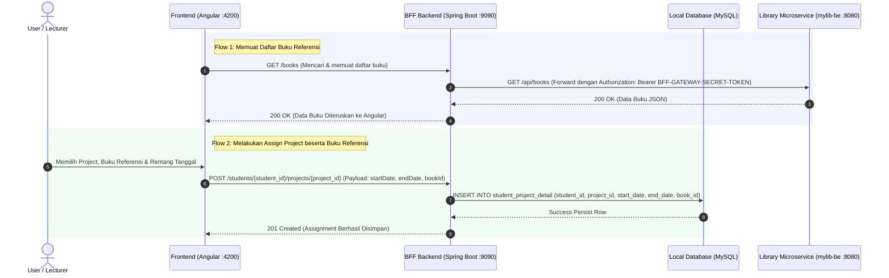

# Knowledge Sharing: BFF Bridge Pattern for Microservice Integration

Dokumen ini menjelaskan rancangan arsitektur dan perincian teknis mengenai bagaimana backend `student-management-apps` diubah menjadi **BFF (Backend-For-Frontend) Bridge/Gateway** untuk mengonsumsi data buku dari microservice eksternal `mylib-be`.

---

## 🏗️ Gambaran Arsitektur

Secara arsitektural, komunikasi data dirancang menggunakan pola **BFF (Backend-For-Frontend)**:

```text
student-management-apps/frontend (Angular) [Port: 4200]
                  ↓ (Hanya berkomunikasi ke BFF)
student-management-apps/backend (BFF Gateway - Spring Boot) [Port: 9090]
                  ↓ (Meneruskan request secara transparan)
mylib-be (Library Microservice - Spring Boot) [Port: 8080/api]
```

Dengan pola ini, Angular frontend tidak perlu tahu keberadaan atau port milik `mylib-be`. BFF bertindak sebagai jembatan tunggal yang aman dan terpusat.

### 📊 Diagram Alir Data (Sequence Diagram)

Berikut adalah diagram urutan langkah komunikasi data ketika menampilkan daftar buku referensi serta menyimpan *project assignment* baru:



---

## 🛠️ Perubahan Teknis pada Sisi Backend (BFF)

Berikut adalah detail komponen backend yang dikonfigurasi dan dikembangkan:

### 1. Registrasi REST Client ([RestTemplateConfig.java](file:///Users/satyahelfia/student-management-apps/backend/src/main/java/com/satya/assignment/config/RestTemplateConfig.java))
Mendaftarkan *bean* `RestTemplate` ke Spring Application Context untuk digunakan sebagai HTTP client internal BFF guna memanggil endpoint REST milik `mylib-be`.

```java
package com.satya.assignment.config;

import org.springframework.context.annotation.Bean;
import org.springframework.context.annotation.Configuration;
import org.springframework.web.client.RestTemplate;

@Configuration
public class RestTemplateConfig {
    @Bean
    public RestTemplate restTemplate() {
        return new RestTemplate();
    }
}
```

---

### 2. Controller Proxy Jembatan Buku ([BookController.java](file:///Users/satyahelfia/student-management-apps/backend/src/main/java/com/satya/assignment/web/BookController.java))
Membuat routing `/books` sebagai perantara transparan untuk mengonsumsi API `mylib-be` (`/api/books`):
* **Bypass Autentikasi (`MOCK_TOKEN`):** Menggunakan token rahasia `BFF-GATEWAY-SECRET-TOKEN` yang disuntikkan secara otomatis melalui header `Authorization: Bearer <TOKEN>` agar request diperlakukan sebagai akses tingkat `SUPER_ADMIN` (`admin@mylib.com`) tanpa memaksa pengguna frontend login ulang.
* **Propagasi Error:** Menangkap kueri REST HTTP yang gagal dengan `HttpStatusCodeException` untuk diteruskan kembali ke frontend dengan kode status HTTP dan body JSON asli yang sama persis.
* **Penerusan Gambar Cover (*Multipart Form-Data*):** Menggunakan helper `MultipartInputStreamFileResource` untuk melewatkan unggahan file cover thumbnail secara langsung ke `mylib-be`.

---

### 3. Migrasi Skema Database MySQL Lokal
Menambahkan kolom `book_id` ke tabel `student_project_detail` untuk mencatat referensi ID buku (UUID) dari `mylib-be`:

```sql
ALTER TABLE student_project_detail ADD COLUMN book_id VARCHAR(36) DEFAULT NULL;
```

---

### 4. Pembaruan Entitas & DTO Pemetaan
* **JPA Entity ([StudentProject.java](file:///Users/satyahelfia/student-management-apps/backend/src/main/java/com/satya/assignment/entity/StudentProject.java)):** Menambahkan properti `bookId` dan memetakan secara langsung ke kolom database `book_id`.
  ```java
  @Column(name = "book_id")
  private String bookId;

  public String getBookId() { return bookId; }
  public void setBookId(String bookId) { this.bookId = bookId; }
  ```
* **DTO ([AssignProjectRequest.java](file:///Users/satyahelfia/student-management-apps/backend/src/main/java/com/satya/assignment/web/dto/AssignProjectRequest.java)):** Menambahkan field `bookId` agar dapat menerima ID buku yang dipilih di frontend.
  ```java
  private String bookId;
  public String getBookId() { return bookId; }
  public void setBookId(String bookId) { this.bookId = bookId; }
  ```

---

### 5. Overloading Logika Bisnis & Endpoint REST
* **StudentService ([StudentService.java](file:///Users/satyahelfia/student-management-apps/backend/src/main/java/com/satya/assignment/service/StudentService.java)):** Meng-*overload* method `addProjectToStudent` agar dapat menerima opsi `bookId` sewaktu melakukan Dirty Checking/Save Entity, dengan tetap mempertahankan backward compatibility untuk method 4 parameter.
  ```java
  @Transactional
  public Student addProjectToStudent(int studentId, int projectId, LocalDateTime startDate, LocalDateTime endDate, String bookId) {
      ...
      StudentProject detail = new StudentProject(studentId, projectId, startDate, endDate);
      detail.setBookId(bookId);
      studentProjectRepository.save(detail);
      return saved;
  }
  ```
* **StudentController ([StudentController.java](file:///Users/satyahelfia/student-management-apps/backend/src/main/java/com/satya/assignment/web/StudentController.java)):** Memperbarui method `@PostMapping("/{student_id}/projects/{project_id}")` untuk mengekstrak `bookId` dari DTO request dan meneruskannya ke method service terupdate.

---

## 🎯 Kesimpulan & Keunggulan Desain
* **Loosely Coupled:** Database BFF hanya mencatat ID buku (`book_id`) tanpa perlu menduplikasi tabel buku atau relasi rumit lainnya dari `mylib-be`.
* **Zero Double Auth:** Pengguna frontend terautentikasi otomatis ke `mylib-be` di balik layar menggunakan token bypass khusus BFF yang divalidasi dengan aman.
* **Unified UI Experience:** Dari sudut pandang frontend Angular, semua transaksi berjalan secara sentral ke port `9090` (BFF) yang membuat sistem terasa utuh dan responsif.
