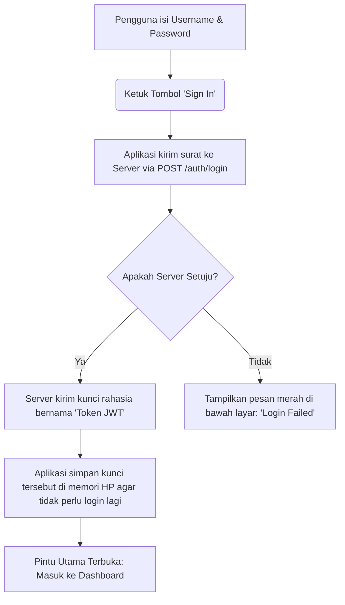
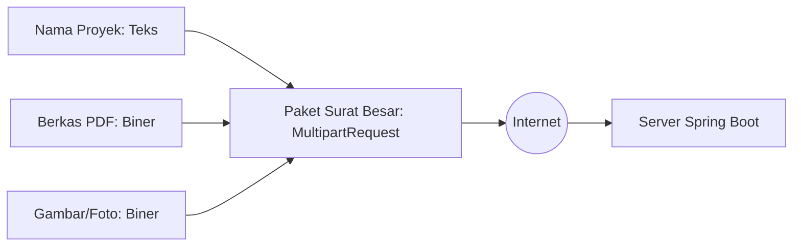

# Panduan Berbagi Pengetahuan (Knowledge Sharing): Bagaimana Aplikasi Mobile Kita Bekerja? 🚀

Selamat datang di panduan santai dan lengkap tentang bagaimana **Aplikasi Mobile (Student Management App)** kita dibuat, bagaimana aplikasi tersebut berjalan di dalam HP Anda, dan bagaimana ia berkomunikasi dengan server backend!

Dokumen ini ditulis khusus dengan bahasa yang sangat sederhana, tanpa istilah-istilah rumit yang membingungkan. Jika Anda sama sekali tidak memiliki latar belakang pemrograman mobile, jangan khawatir! Panduan ini dirancang khusus agar Anda bisa memahaminya dalam sekali baca menggunakan analogi dunia nyata.

---

## 🍽️ Analogi Dunia Nyata: "Restoran Student Management"

Untuk memahami bagaimana seluruh sistem ini bekerja, bayangkan sebuah **Restoran Mewah**:

1. **Dapur Restoran (Backend / Spring Boot):**  
   Di sinilah tempat makanan (data siswa, data proyek, nilai) disimpan, dimasak, dan diolah. Dapur ini bekerja di belakang layar. Pembeli tidak bisa masuk langsung ke dapur.
2. **Meja Makan & Buku Menu (Aplikasi Mobile / Flutter):**  
   Ini adalah apa yang Anda (pengguna) lihat di layar HP. Tampilannya cantik, bersih, ada tombol, tabel, dan warna. Ini adalah tempat Anda berinteraksi dan menikmati hidangan.
3. **Pelayan Restoran (API Service / `api_service.dart`):**  
   Saat Anda menekan tombol "Tambah Siswa" di HP, Pelayan (API Service) akan mencatat pesanan Anda, lalu berlari ke Dapur (Spring Boot) untuk meminta makanan tersebut. Setelah Dapur selesai memasak, Pelayan membawa piring berisi makanan kembali ke meja Anda (layar HP) untuk disajikan.

---

## 🏗️ 1. Apa itu Flutter dan Dart?

Aplikasi mobile kita dibangun menggunakan teknologi bernama **Flutter** dan bahasa pemrograman bernama **Dart**.

* **Dart (Bahasa Obrolan):**  
  Dart adalah bahasa instruksi yang kita gunakan untuk menulis logika aplikasi (misalnya: *"Jika tombol masuk ditekan, periksa apakah kotak teks kosong atau tidak"*).
* **Flutter (Mesin Pembuat Tampilan):**  
  Flutter adalah alat buatan Google yang bisa menerjemahkan bahasa Dart tadi menjadi tampilan visual di layar HP. Hebatnya Flutter adalah **Satu Kode untuk Semua**: Kita cukup menulis kode sekali, dan Flutter bisa otomatis mengubahnya menjadi aplikasi Android, iPhone (iOS), macOS, Windows, bahkan Situs Web (Chrome)!

---

## 📂 2. Struktur Folder: Mengintip Isi "Kotak Mainan" Aplikasi

Saat Anda membuka folder `mobile_app`, Anda akan melihat banyak folder. Mari kita bedah fungsinya satu per satu seperti bagian-bagian rumah:

```text
mobile_app/
├── android/        --> Cetakan khusus agar aplikasi bisa dipasang di HP Android.
├── ios/            --> Cetakan khusus agar aplikasi bisa dipasang di iPhone (iOS).
├── web/            --> Cetakan khusus agar aplikasi bisa dibuka di browser internet (Chrome/Safari).
├── pubspec.yaml    --> "Daftar Belanjaan" aplikasi (berisi pustaka luar yang ingin dipakai, seperti File Picker).
└── lib/            --> "Isi Rumah Utama" (tempat seluruh kode aplikasi kita ditulis).
```

Mari kita masuk ke dalam folder utama tempat kita menulis kode, yaitu folder **`lib/`**:

### A. `lib/main.dart` (Pintu Gerbang Utama)
Ini adalah file pertama yang akan dibaca oleh HP saat aplikasi dibuka. Tugas utamanya hanya satu: menyalakan lampu rumah, menyiapkan tema warna, lalu membuka pintu pertama yaitu **Halaman Login**.

### B. `lib/theme/app_theme.dart` (Desainer Interior)
File ini menentukan "kepribadian visual" aplikasi kita. Di sinilah kita mengatur cat dinding warna Slate, warna Indigo untuk tombol aktif, warna putih bersih untuk latar belakang (Light Theme), dan ukuran font agar tulisan terlihat sangat premium dan nyaman dibaca.

### C. `lib/services/api_service.dart` (Kurir Pengantar Surat)
Ini adalah "Pelayan Restoran" kita! File ini tidak memiliki tampilan visual. Isinya adalah kumpulan instruksi bagaimana cara mengirim surat (data) melalui internet ke server backend kita. 
* *Contoh:* Mengirim data username dan password untuk masuk, mengambil daftar siswa terbaru, atau mengirim berkas PDF dan Gambar.

### D. `lib/screens/` (Kamar-Kamar di Dalam Rumah)
Di dalam folder ini terdapat lembaran halaman-halaman visual yang akan berganti di layar HP Anda:
1. **`login_screen.dart` (Halaman Login):**  
   Gerbang keamanan. Meminta username dan password Anda. Jika server backend bilang *"Oke, dia admin!"*, halaman ini akan membukakan jalan menuju halaman utama.
2. **`main_screen.dart` (Rumah Induk / Navigasi):**  
   Menyediakan menu navigasi di bagian bawah layar (Dashboard, Students, Projects, Assignments). Saat Anda mengetuk salah satu menu, halaman utama ini akan mengganti isi ruangan di atasnya.
3. **`dashboard_view.dart` (Papan Pengumuman Utama):**  
   Menampilkan ringkasan data penting (Total Siswa, Total Proyek, Batas Maksimal Proyek). Yang menarik, kartu **MAX PROJECTS** di sini bisa diklik untuk mengubah batas penugasan proyek per siswa secara instan!
4. **`students_view.dart` (Daftar Siswa):**  
   Tempat melihat nama-nama siswa, menambah siswa baru, menghapus siswa, serta **mengedit data siswa** (seperti mengubah nilai rata-rata mereka).
5. **`projects_view.dart` (Manajemen Proyek):**  
   Tempat mendaftarkan proyek baru dan mengunggah berkas PDF atau gambar proyek pendukung.
6. **`assignments_view.dart` (Penugasan Proyek):**  
   Tempat untuk menugaskan proyek tertentu kepada siswa pilihan dengan menentukan tanggal mulai dan berakhir proyek tersebut.

---

## 🔄 3. Alur Kerja Utama Aplikasi (Langkah demi Langkah)

Mari kita ikuti perjalanan bagaimana data mengalir dari ketukan jari Anda hingga masuk ke server!

### Alur 1: Proses Masuk Aplikasi (Login)


---

### Alur 2: Cara Mengambil & Menampilkan Data (Siswa/Proyek)
Setiap kali Anda masuk ke halaman Siswa atau Proyek:
1. Ruangan visual (`students_view.dart`) akan memanggil Si Pelayan (`api_service.dart`).
2. Pelayan akan membawa "Kunci Rahasia" (Token JWT) yang disimpan tadi, lalu mengetuk pintu server backend Spring Boot.
3. Server memvalidasi kunci tersebut, mengambil data siswa dari database, dan membungkusnya menjadi format teks rahasia bernama **JSON** (JavaScript Object Notation).
4. Pelayan membawa teks JSON tersebut kembali ke HP Anda.
5. Flutter menerjemahkan teks JSON menjadi kotak-kotak kartu visual siswa yang rahasia, lengkap dengan nilai rata-rata dan tombol aksi.

---

### Alur 3: Fitur Canggih Unggah File & Gambar Proyek (Multipart Upload)
Mengirim nama proyek dalam bentuk teks biasa sangatlah mudah. Namun, bagaimana cara HP mengirim **berkas PDF** atau **Gambar foto** ukuran besar ke server? 

Kita menggunakan metode bernama **Multipart Request (Unggah Multi-Bagian)**:



1. **Memilih Berkas:** Saat Anda mengetuk tombol **Attach PDF** atau **Attach Image**, aplikasi akan membuka pemilih berkas bawaan HP Anda menggunakan paket `file_picker`.
2. **Membaca Byte Data:** HP akan membaca berkas tersebut sebagai deretan angka-angka biner (byte data).
3. **Membungkus Paket Besar:** Aplikasi kita membuat pembungkus surat raksasa bernama `MultipartRequest`. Di dalam surat ini, kita menaruh teks (nama proyek) di satu bagian, byte berkas PDF di bagian kedua, dan byte gambar di bagian ketiga.
4. **Mengirim ke Server:** Surat besar ini dikirim ke server. Server Spring Boot akan membuka segel surat tersebut, menyimpan teksnya, dan menyimpan biner PDF serta gambar tersebut ke dalam kolom database yang aman.

---

## 🔒 4. Perlindungan Ganda: Dialog Konfirmasi (Confirmation Dialogs)

Untuk memastikan pengguna tidak sengaja menghapus data siswa yang penting atau salah menugaskan proyek, aplikasi kita sekarang dilengkapi dengan **Dialog Konfirmasi** yang elegan.

Saat Anda mengetuk tombol aksi (Hapus, Simpan Edit, Tambah Baru, atau Tugaskan Proyek):
1. Layar HP akan menjadi sedikit redup secara dramatis.
2. Sebuah jendela kecil (Dialog) premium muncul di tengah layar menanyakan kejelasan niat Anda: 
   * *"Apakah Anda yakin ingin menghapus siswa 'Andi'?"*
3. Dialog ini menyediakan dua pilihan: **Cancel** (Batal dan kembali aman) atau **Confirm** (Lanjutkan tindakan).
4. Tindakan ke server baru akan dijalankan **hanya jika** Anda mengetuk tombol **Confirm**.

---

## 💻 5. Bagaimana Cara Menjalankan Aplikasi Ini di Komputer Anda?

Jika Anda ingin melihat dan berinteraksi langsung dengan aplikasi ini di komputer Anda, Anda hanya perlu mengetikkan satu baris perintah di terminal komputer Anda!

### Persyaratan Awal:
Pastikan server backend Spring Boot Anda sudah menyala agar aplikasi mobile bisa meminta data!

### Perintah Menjalankan:
Masuk ke folder `mobile_app` di terminal Anda, lalu ketik perintah sesuai dengan di mana Anda ingin mencobanya:

* **Menjalankan di Browser Internet (Google Chrome):**
  ```bash
  flutter run -d chrome
  ```
* **Menjalankan di HP Fisik / Emulator yang terhubung:**
  ```bash
  flutter run
  ```

*Aplikasi Anda akan segera dikompilasi oleh Flutter dan tampil secara ajaib di layar Anda dalam waktu beberapa detik!*

---

## 📝 Ringkasan Istilah Penting untuk Anda:

| Istilah | Apa Artinya dalam Bahasa Sederhana? |
| :--- | :--- |
| **Widget** | Komponen visual pembentuk layar HP (seperti lego: tombol, teks, gambar, kotak). |
| **Token JWT** | Kunci keamanan digital rahasia yang didapat setelah login sukses agar kita diizinkan melihat data. |
| **JSON** | Format teks sederhana untuk mengirim data antar komputer melalui internet. |
| **StatefulWidget** | Halaman visual yang isinya bisa berubah-ubah secara dinamis tanpa harus keluar dari halaman tersebut (misal: halaman yang memuat loading lalu berubah menampilkan daftar siswa). |
| **Multipart** | Cara mengirim file/gambar berukuran besar melalui internet dengan membaginya menjadi beberapa bagian paket. |

---

Sekarang Anda sudah memahami sepenuhnya bagaimana **Aplikasi Mobile Student Management** Anda bekerja! Selamat mencoba fitur-fitur barunya dan semoga hari Anda menyenangkan! 🚀
